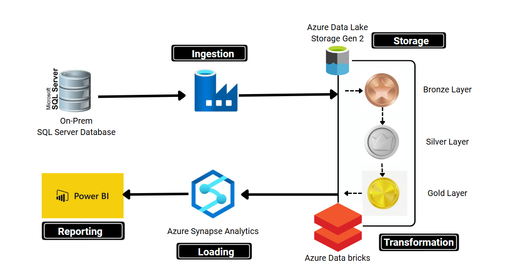
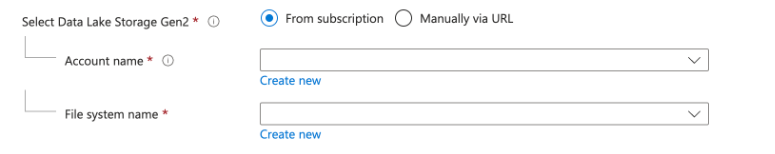
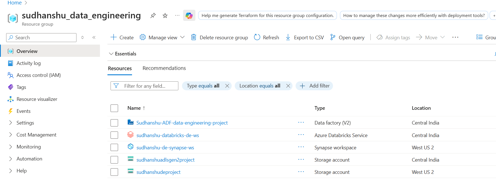
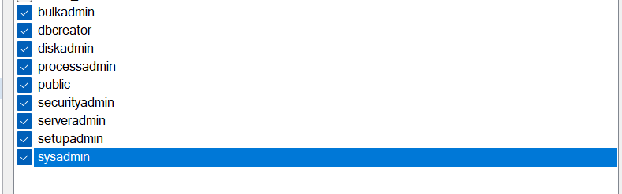
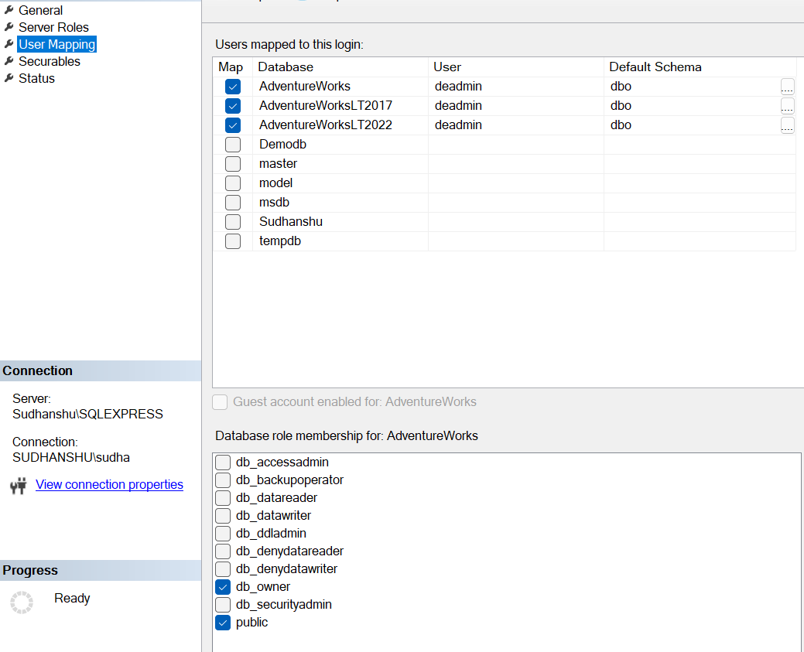
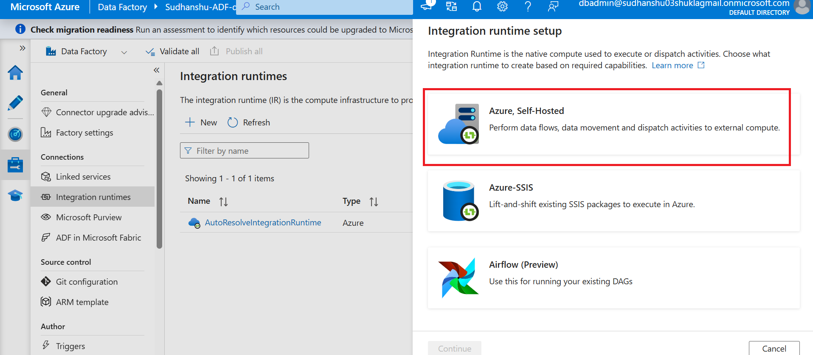
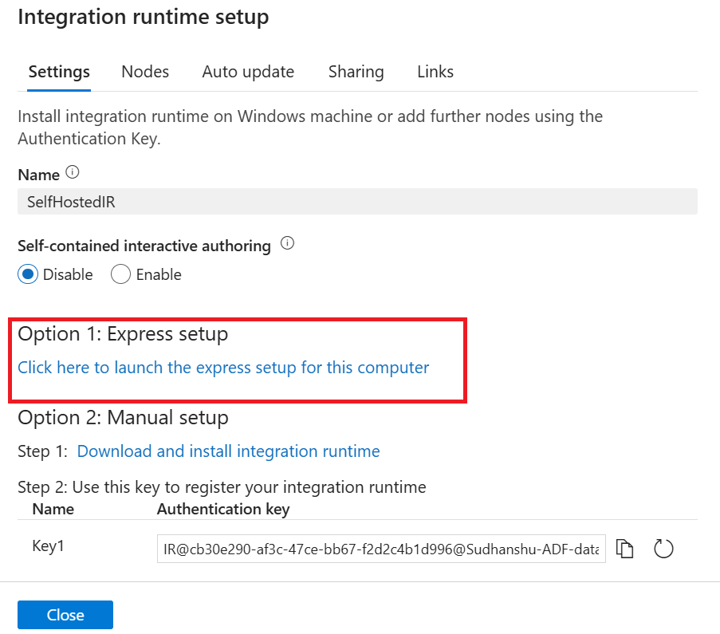
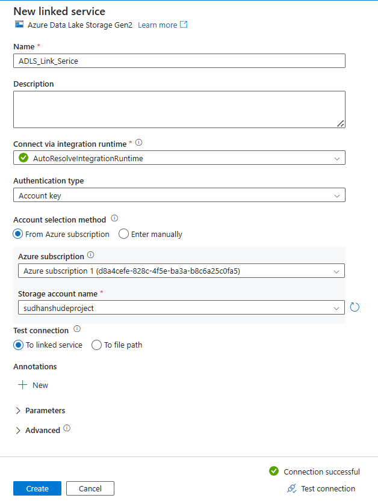
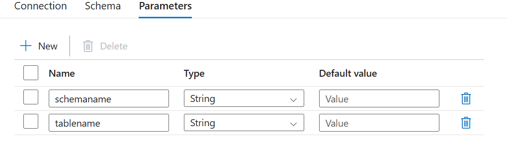
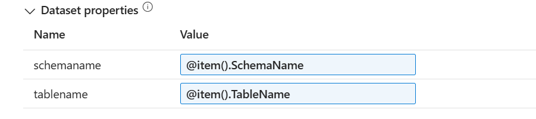

# Azure-Data-Engineering-Project-On-premise-SQL-Server

## **Introduction:**
This project demonstrates an end-to-end data engineering solution using an on-premises SQL Server as the source system and Azure cloud services. 
Data is ingested using Azure Data Factory and stored in ADLS Gen2 following the Medallion architecture (Bronze, Silver, Gold).
Databricks is used for scalable data transformation, with Azure Synapse enabling analytical querying and Power BI delivering business insights.

## **Dataset:**
We have used AdventureWorks database as SQL data source. 
The AdventureWorks database is a popular and widely-used sample database provided by Microsoft for SQL Server.

Go to : Microsoft GitHub repository:

  
    https://github.com/Microsoft/sql-server-samples/releases/tag/adventureworks

download the below db backup:\
AdventureWorks2022.bak \

Go on this link to learn how to restore the db in SSMS :

    https://learn.microsoft.com/en-us/sql/samples/adventureworks-install-configure?view=sql-server-ver16&tabs=ssms

## **Project Architecture:**

## **Create Azure Resources for the project:**

### **Create Resource Group:**
Create a resource group in Azure portal to hold all the other resources.

### **Create Azure Data Factory:**
Resource Group > Create > Azure Data Factory > Create > (give data factory name, resource group, subscription and create)

### **Create Azure Synapse Analytics and Storage Account:**
Resource Group > Create > Azure Synapse Analytics > Create > 
#### Basics Tab (Project Details) :
Choose your subscription and resource group (This will be automatically selected)\
Ignore the Managed resource group drop down. (This will be automatically created if not specified)

1. Account Name (This is the Storage Account Name)- Click on the "Create new" link and give it a name.
2. File System Name (This is the container name)- Click on the "Create new" link and give it a name as "bronze".
3. Review and create.

### **Create Azure Databricks:**
Resource Group > Create > Azure Data Factory > Create > (give data bricks resource name, resource group, subscription and create)

## **All Azure Resources for the project:**

## **Create new SQL server authentication:**
1. Go to SQL server and login : Windows authentication.
2. go to : Securities > New user > give user id > select SQL server authentication > give password > create.
3. Give all the roles:
   
4. #### SQL User Mapping:
   - Select the proper Databses.
   - give dbowner role.
     
     

## **Data Ingestion:**
* Go to Azure Data Factory > Launch Studio.
* Go to Integration runtimes > New > Create > Azure Self Hosted Integration runtimes
  
  
  
* Create with these below options :
  
  
* Create Linked Service > Select the **Self Hosted Integration Service** and **SQL Server Authentication**\
  Give deatils of the SQL db we created in SSMS and test connection.

  

  ### **create pipeline : **
  - Ingest_data_from SQl_server.
  - Before that get all the tables list in SQL server using the below scripts:
 
        SELECT
        s.name AS SchemaName,
        t.name AS TableName
        FROM sys.tables t
        INNER JOIN sys.schemas s
        ON t.schema_id = s.schema_id
        WHERE s.name = 'SalesLT'
  - Create one Lookup Activeity : Look table name from SQL server
  - In settings > Create new data set > SQL server > leave the tables name blank.
  - In lokup activity select Query option. Remember to uncheck the**First row Only** Option.
  - we will get a JSON output from the lookup activity with all the table names.
  - Now to fetch the table names from the JSON we will apply **For Each Activity** on the output of lokup.
  - In For Each Activity > Settings > Items > Dynamic Content >
 
        @activity('Look table name from SQL server').output.value
  - Inside For Each Activity > Copy Data (Copy Each Table) > Select Source Data Set
  - Go to Query and put the below statement there:

        @{concat('select * FROM ',item().Schemaname,'.',item().Tablename)}
  - Configure the Sink :
    New > Azure Data Lake Storage Gen2 > Parquet > Create a new link service for Azure :

    

  - Select **Bronze** container.
  - to maintain the proper folder structure as : Bronze/SchemaName/TableName/TableName.Parquet
    edit the Sink dataset.
  - Create two Sink Parameters:

    

  - And give dynamic Parameter Values :

    
